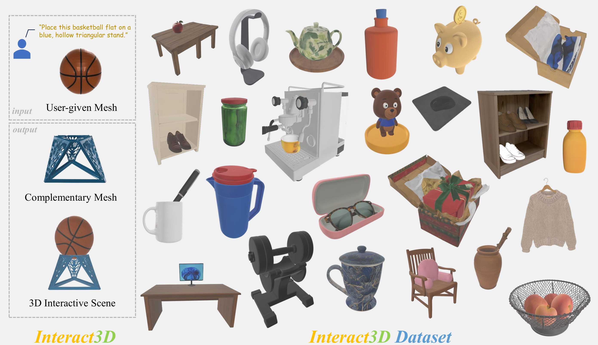
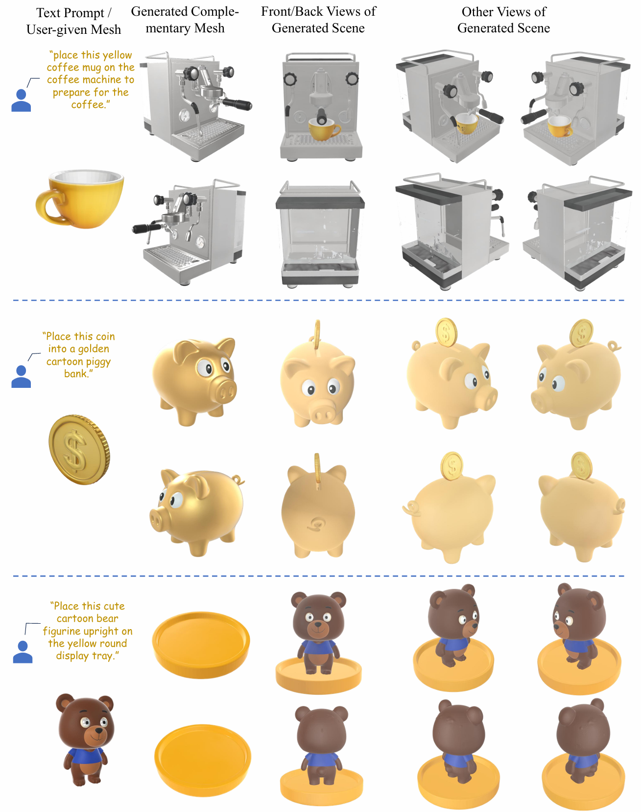
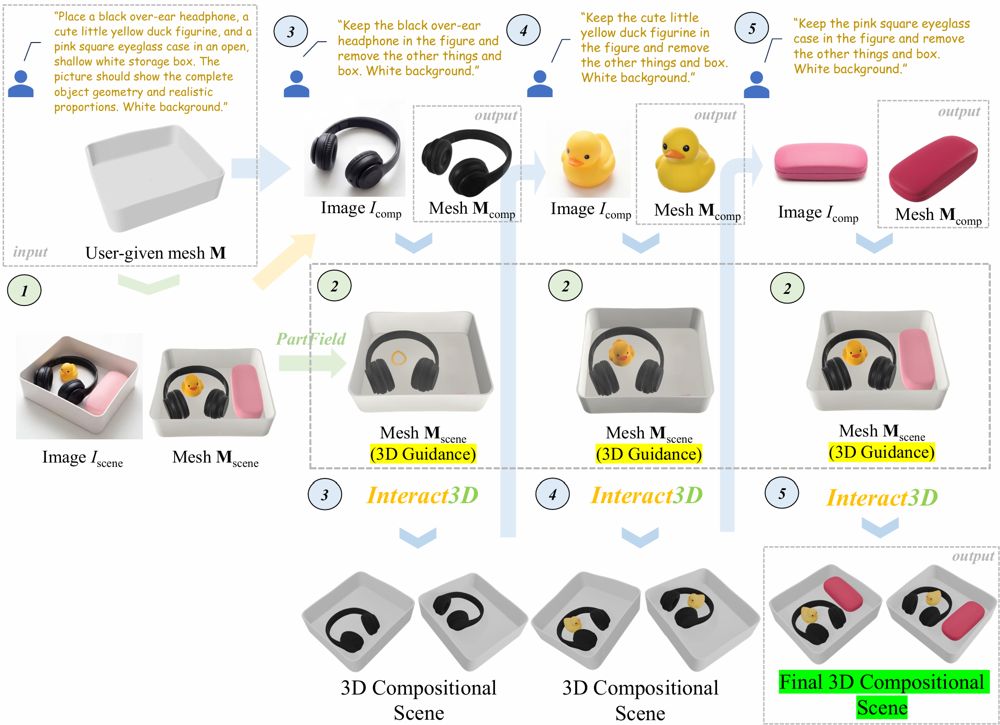
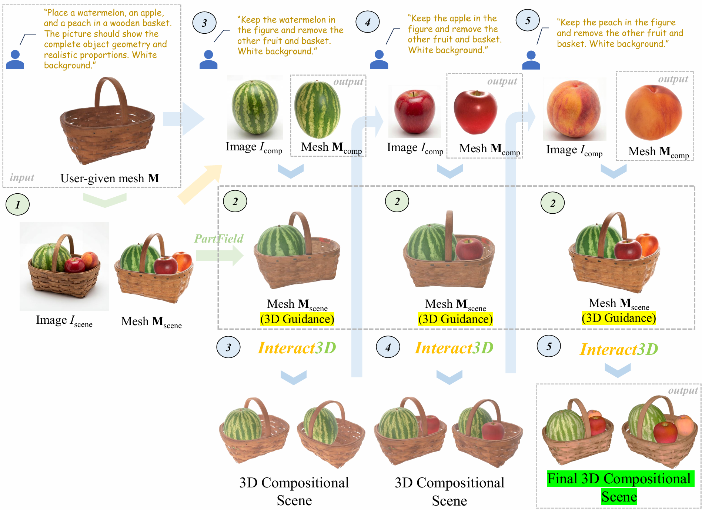

# Interact3D: Compositional 3D Generation of Interactive Objects

## Overview

**Interact3D** generates physically plausible, interactive 3D compositional objects by overcoming typical occlusion and object-object relationship (OOR) challenges. The framework synthesizes high-fidelity individual assets and physically composes them under a unified 3D guidance scene via a two-stage pipeline: global-to-local geometric registration for anchoring, followed by SDF-based optimization to strictly penalize intersections. To resolve unavoidable spatial conflicts, a VLM-driven agentic refinement module autonomously analyzes multi-view renderings to iteratively self-correct the generated complementary assets, yielding high-quality, collision-aware and interactive 3D scenes. 🙌🙌🙌

---

## TODO List
- [ ] 🎯 Single-sample Inference Code
- [ ] 🏭 Batch Inference Code
- [ ] 🧊 Interact3D Dataset

⭐ We will open-source the Single-sample Inference Code and Batch Inference Code within 4 months, and the Interact3D Dataset within 6 months.

---

## Get Started with Interact3D (🚀 coming soon)
 

---
## Qualitative Results (More results can be seen in the paper)
**Two Parts Composition Results.** 

 

---

**More Parts Composition Results.** 

 

 

---

## 📜 Citation
If you find this repository useful in your project, please cite the following work. :)
```
@article{shan2026interact3d,
  title={Interact3D: Compositional 3D Generation of Interactive Objects},
  author={Shan, Hui and Luo, Keyang and Li, Ming and Zheng, Sizhe and Fu, Yanwei and Chen, Zhen and Huang, Xiangru},
  journal={arXiv preprint arXiv:2603.16085},
  year={2026}
}
```